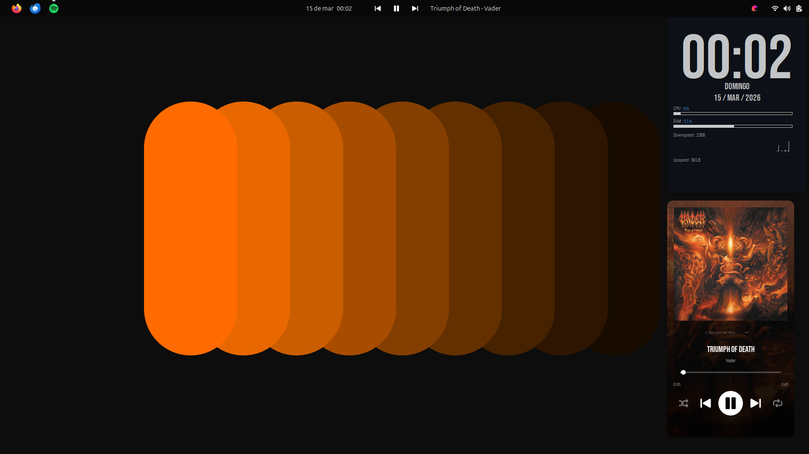
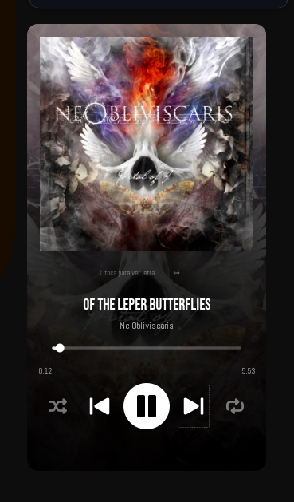
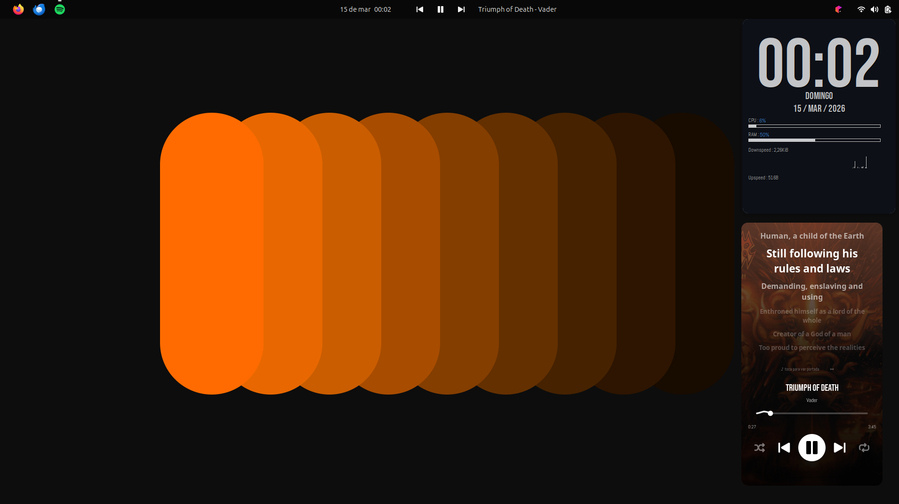
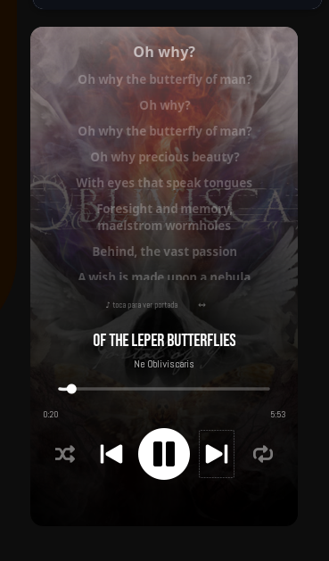

# Spotify Widget for Linux

A lightweight, standalone Spotify player widget built with Python + GTK3.
Displays album art, track info, playback controls, seek bar, volume, lyrics, and Spotify Canvas videos — all in a floating, transparent window that adapts to your desktop colors via **pywal**.

---

## Features

- **Album art** with smooth display
- **Track info** — title, artist, album
- **Playback controls** — previous, play/pause, next
- **Seek bar** with elapsed/total time
- **Volume control** slider
- **Lyrics view** — synchronized lyrics via LRClib (click the album art to toggle)
- **Spotify Canvas** — animated video background when available (requires `sp_dc` cookie)
- **Responsive layout** — toggle between vertical and horizontal mode with the `⇔` button
- **Pywal integration** — colors adapt automatically to your wallpaper via `~/.cache/wal/colors.json`
- Supports both **Spotify Web API** (full control) and **playerctl fallback** (no credentials needed)

---

## Preview

### Vertical mode



### Lyrics view



### Demo video
https://github.com/GustavoGamarra95/spotify-widget/raw/master/screenshots/demo.mp4

---

## Requirements

### System packages

```bash
sudo apt install python3 python3-gi python3-cairo \
  gir1.2-gtk-3.0 gir1.2-gst-plugins-base-1.0 \
  gstreamer1.0-plugins-good gstreamer1.0-plugins-bad \
  playerctl
```

### Python packages

```bash
pip install spotipy
```

> `spotipy` is optional — the widget works without it using `playerctl` only.

---

## Installation

1. **Clone or download** this repository:

```bash
git clone https://github.com/GustavoGamarra95/spotify-widget.git
cd spotify-widget
```

2. **Copy the widget script:**

```bash
cp spotify-widget.py ~/.config/conky/
```

3. **Create the config file** at `~/.config/spotify-widget/config.json`:

```bash
mkdir -p ~/.config/spotify-widget
```

```json
{
  "client_id":     "YOUR_SPOTIFY_CLIENT_ID",
  "client_secret": "YOUR_SPOTIFY_CLIENT_SECRET",
  "redirect_uri":  "http://localhost:8888/callback",
  "sp_dc":         "YOUR_SP_DC_COOKIE"
}
```

> - `client_id` / `client_secret` / `redirect_uri`: from your [Spotify Developer Dashboard](https://developer.spotify.com/dashboard).
> - `sp_dc`: optional, needed only for Spotify Canvas animated backgrounds.
> - Without these fields the widget still works via `playerctl`.

4. **Run the widget:**

```bash
python3 ~/.config/conky/spotify-widget.py &
```

---

## Getting Spotify API credentials

1. Go to [developer.spotify.com/dashboard](https://developer.spotify.com/dashboard)
2. Log in and click **Create App**
3. Set the **Redirect URI** to `http://localhost:8888/callback`
4. Copy your **Client ID** and **Client Secret** into `config.json`
5. On first run, a browser window will open to authorize the app

---

## Configuration

Edit the top of `spotify-widget.py` to change size:

```python
WIN_W, WIN_H = 300, 560   # width, height in pixels
```

To change the horizontal layout dimensions, edit line ~1008:

```python
self.resize(max(w, h), min(w, h))
```

---

## Usage

| Action | How |
|--------|-----|
| Play / Pause | Click the center button |
| Previous / Next | Click `⏮` / `⏭` |
| Seek | Drag the progress bar |
| Volume | Drag the volume slider |
| Toggle lyrics | Click the album art |
| Toggle layout | Click the `⇔` button |

---

## Pywal support

If you use [pywal](https://github.com/dylanaraps/pywal), the widget automatically reads `~/.cache/wal/colors.json` and applies your current color scheme. No extra configuration needed.

---

## License

MIT
